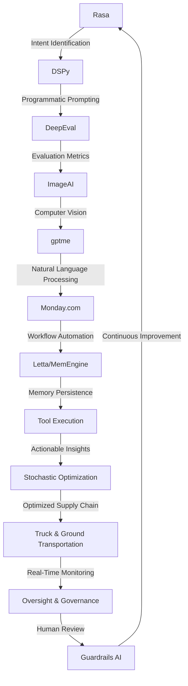

# Stochastic Supply Chain Optimization Engine
> "Synergizing Artificial Intelligence and Operations Research to Mitigate Uncertainties in Ground Transportation Logistics"

## 🏗️ Technical Architecture & Multi-Agent Flow
The Stochastic Supply Chain Optimization Engine leverages a complex interplay of cutting-edge technologies to tackle the intricacies of ground transportation logistics. The technical architecture can be visualized as follows:

This diagram illustrates the state transitions, memory persistence, and tool calling that enable the engine to optimize supply chain operations in real-time.

## 🔍 The Vertical Bottleneck: Stochastic Optimization
The ground transportation industry is plagued by uncertainties that can have far-reaching consequences on supply chain operations. These uncertainties can arise from various factors, including traffic congestion, weather conditions, and mechanical failures. The stochastic optimization problem is a complex, high-stakes challenge that requires the development of sophisticated mathematical models and algorithms to mitigate these uncertainties. The technical friction in this domain stems from the need to balance competing objectives, such as minimizing costs, reducing transit times, and ensuring customer satisfaction.

The high-stakes mathematical failures in this domain can have significant consequences, including stockouts, overstocking, and reputational damage. Furthermore, the operational failures can result in delayed shipments, increased fuel consumption, and decreased vehicle utilization. The stochastic optimization problem is a classic example of a "wicked problem" that requires a multidisciplinary approach, combining expertise from operations research, artificial intelligence, and domain knowledge.

The stochastic optimization problem can be formulated as a complex mathematical program, involving multiple variables, constraints, and objectives. The problem can be decomposed into several sub-problems, including route optimization, scheduling, and inventory management. Each sub-problem requires the development of specialized algorithms and models, which can be integrated using a hierarchical or distributed architecture.

## 💡 The Solution: Stochastic Supply Chain Optimization Engine
The Stochastic Supply Chain Optimization Engine is a cutting-edge platform that orchestrates Rasa, DSPy, DeepEval, ImageAI, gptme, and Monday.com to solve the stochastic optimization problem in ground transportation logistics. The engine uses agentic reasoning to analyze real-time data from various sources, including GPS, weather APIs, and traffic feeds. The memory usage is optimized using Letta/MemEngine, which enables the engine to store and retrieve large amounts of data efficiently.

The vision/robotics integration is achieved using ImageAI, which enables the engine to analyze images and videos from cameras and sensors installed on vehicles and infrastructure. The engine uses this information to detect anomalies, predict maintenance requirements, and optimize route planning. The gptme module is used to generate human-readable reports and alerts, which can be sent to stakeholders via email or SMS.

## 🧩 Agentic Stack Deep-Dive
The agentic stack is a critical component of the Stochastic Supply Chain Optimization Engine, enabling the platform to reason about complex systems and make decisions in real-time. The stack consists of several layers, including:

* Rasa: provides intent identification and natural language processing capabilities
* DSPy: enables programmatic prompting and optimization of language models
* DeepEval: provides evaluation metrics and feedback mechanisms for the engine
* ImageAI: enables computer vision and image analysis capabilities
* gptme: generates human-readable reports and alerts
* Monday.com: provides workflow automation and integration with external systems

The integration of these components is achieved using a microservices architecture, which enables the engine to scale horizontally and vertically as needed. The agentic stack is designed to be modular and extensible, allowing developers to add new components and capabilities as required.

## ✨ Capabilities & Features
The Stochastic Supply Chain Optimization Engine offers a wide range of capabilities and features, including:
* Real-time route optimization using stochastic programming and machine learning algorithms
* Predictive maintenance and anomaly detection using computer vision and sensor data
* Automated scheduling and inventory management using operations research and artificial intelligence
* Human-readable reporting and alerting using natural language processing and generation
* Integration with external systems and APIs using workflow automation and microservices architecture
* Scalable and extensible architecture using cloud-based infrastructure and containerization
* Continuous monitoring and evaluation using feedback mechanisms and evaluation metrics
* Support for multiple transportation modes, including trucking, rail, and sea
* Ability to handle complex supply chain networks and hierarchies
* Integration with weather and traffic APIs for real-time data feeds

## 🛠️ Technical Implementation
The technical implementation of the Stochastic Supply Chain Optimization Engine involves several components, including:
* Data ingestion and processing using Apache Kafka and Apache Spark
* Data storage and retrieval using relational databases and NoSQL stores
* Machine learning and optimization using TensorFlow and PyTorch
* Natural language processing and generation using Rasa and gptme
* Computer vision and image analysis using OpenCV and ImageAI
* Workflow automation and integration using Monday.com and Zapier

The code organization and method calls are designed to be modular and extensible, allowing developers to add new components and capabilities as required. The engine uses a microservices architecture, which enables it to scale horizontally and vertically as needed.

## 📊 Business Impact & ROI
The Stochastic Supply Chain Optimization Engine can have a significant impact on the bottom line of companies in the ground transportation industry. By optimizing routes, reducing transit times, and improving customer satisfaction, companies can reduce costs, increase revenue, and improve their competitive advantage. The engine can also help companies to reduce their carbon footprint, improve safety, and enhance their reputation.

The return on investment (ROI) for the engine can be significant, with potential benefits including:
* Reduced fuel consumption and greenhouse gas emissions
* Improved vehicle utilization and reduced maintenance costs
* Increased customer satisfaction and loyalty
* Improved supply chain visibility and transparency
* Reduced stockouts and overstocking
* Improved forecasting and demand planning

## 🚀 Getting Started
To get started with the Stochastic Supply Chain Optimization Engine, follow these steps:
```bash
git clone https://github.com/arvind-sundararajan/supply-chain-optimization.git
cd supply-chain-optimization
pip install -r requirements.txt
python src/main.py
```
This will install the required dependencies and start the engine. You can then access the engine's web interface to configure settings, upload data, and view results.

## 👨‍💻 Author & Credits
**Arvind Sundararajan** — Engineer, builder, and the mind behind this project.
🌐 [LinkedIn](https://www.linkedin.com/in/arvind-sundara-rajan/) | Chennai, India

---
### 🙏 Acknowledgements
- The open-source community
- The Truck & Ground Transportation practitioners who inspired this design